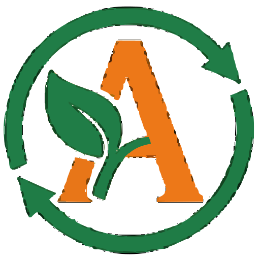

# 🌱 GreeAlex - Sustainable Future Platform

<div align="center">
  
  
  **Building a sustainable future with cutting-edge technology and environmental consciousness**
  
  [](https://reactjs.org/)
  [](https://www.typescriptlang.org/)
  [](https://vitejs.dev/)
  [](https://tailwindcss.com/)
  [](https://ui.shadcn.com/)
  [](LICENSE)
</div>

## 🚀 Overview

GreeAlex is a comprehensive environmental sustainability platform that connects users with eco-friendly actions, rewards sustainable behavior, and partners with organizations to create a greener future. The platform features bilingual support (Arabic/English), gamification elements, and partnerships with leading environmental organizations.

### ✨ Key Features

- 🌍 **Bilingual Support**: Full Arabic and English localization with RTL support
- 🎮 **Gamification**: Earn "Genz Points" for completing environmental actions
- 🏆 **Rewards System**: Redeem points for eco-friendly products and services
- 🤝 **Partnership Network**: Collaborate with environmental organizations
- 📊 **Progress Tracking**: Monitor your environmental impact
- 🎯 **Community Events**: Join local sustainability activities
- 💳 **Banking Integration**: Secure partnership with Alex Bank
- 📱 **Responsive Design**: Optimized for all devices

## 🛠️ Technology Stack

### Frontend
- **React 18** - Modern React with hooks and functional components
- **TypeScript** - Type-safe development with full IntelliSense
- **Vite** - Lightning-fast build tool and dev server
- **Tailwind CSS** - Utility-first CSS framework
- **shadcn/ui** - High-quality React components
- **Lucide React** - Beautiful SVG icons
- **Framer Motion** - Smooth animations and transitions

### Development Tools
- **ESLint** - Code linting and formatting
- **PostCSS** - CSS processing and optimization
- **PNPM** - Fast, disk space efficient package manager
- **Git** - Version control with semantic commits

### Build & Deployment
- **GitHub** - Code repository and collaboration
- **Vite Build** - Optimized production builds
- **Modern Browser Support** - ES2020+ features

## 📁 Project Structure

```
gree-alex/
├── 📁 public/                    # Static assets
│   ├── favicon.svg              # App favicon
│   ├── robots.txt               # SEO robots file
│   └── 📁 images/               # Image assets
│       ├── 📁 partners/         # Partner logos
│       └── *.jpg                # Various images
├── 📁 src/                      # Source code
│   ├── 📁 components/           # React components
│   │   ├── 📁 ui/               # shadcn/ui components
│   │   ├── 📁 dashboard/        # Dashboard components
│   │   ├── 📁 layout/           # Layout components
│   │   ├── 📁 leaderboard/      # Leaderboard components
│   │   ├── 📁 partners/         # Partner components
│   │   ├── 📁 profile/          # Profile components
│   │   └── 📁 rewards/          # Rewards components
│   ├── 📁 hooks/                # Custom React hooks
│   │   ├── use-mobile.tsx       # Mobile detection hook
│   │   └── use-toast.ts         # Toast notification hook
│   ├── 📁 lib/                  # Utility libraries
│   │   ├── constants.ts         # App constants and mock data
│   │   └── utils.ts             # Utility functions
│   ├── 📁 pages/                # Page components
│   │   ├── Index.tsx            # Homepage (main)
│   │   ├── Leaderboard.tsx      # Leaderboard page
│   │   ├── Partners.tsx         # Partners page
│   │   ├── Profile.tsx          # User profile page
│   │   ├── Rewards.tsx          # Rewards page
│   │   └── NotFound.tsx         # 404 error page
│   ├── App.tsx                  # Main App component
│   ├── main.tsx                 # React entry point
│   ├── index.css                # Global styles
│   └── vite-env.d.ts            # Vite type definitions
├── 📄 Configuration Files
│   ├── package.json             # Dependencies and scripts
│   ├── vite.config.ts           # Vite configuration
│   ├── tailwind.config.ts       # Tailwind configuration
│   ├── tsconfig.json            # TypeScript configuration
│   ├── eslint.config.js         # ESLint configuration
│   ├── postcss.config.js        # PostCSS configuration
│   └── components.json          # shadcn/ui configuration
└── README.md                    # Project documentation
```

## 🚀 Quick Start

### Prerequisites

- **Node.js** (version 18.0 or higher)
- **PNPM** (recommended) or npm/yarn
- **Git** for version control

### Installation

1. **Clone the repository**
   ```bash
   git clone https://github.com/Fady2024/GreeAlex.git
   cd GreeAlex
   ```

2. **Install dependencies**
   ```bash
   pnpm install
   # or
   npm install
   ```

3. **Start development server**
   ```bash
   pnpm run dev
   # or
   npm run dev
   ```

4. **Open in browser**
   ```
   http://localhost:5173
   ```

## 📜 Available Scripts

| Command | Description |
|---------|-------------|
| `pnpm run dev` | Start development server with hot reload |
| `pnpm run build` | Build production-ready application |
| `pnpm run preview` | Preview production build locally |
| `pnpm run lint` | Run ESLint for code quality checks |

## 🎨 Component Library

### UI Components (shadcn/ui)
All components are available at `@/components/ui/`:

**Form Components**
- `Button` - Interactive buttons with variants
- `Input` - Text input fields
- `Select` - Dropdown selection
- `Checkbox` - Boolean input
- `RadioGroup` - Single selection from options

**Layout Components**
- `Card` - Content containers
- `Badge` - Status indicators
- `Separator` - Visual dividers
- `Tabs` - Tabbed navigation
- `Sheet` - Slide-out panels

**Feedback Components**
- `Alert` - Important messages
- `Toast` - Temporary notifications
- `Progress` - Progress indicators
- `Skeleton` - Loading placeholders

**Navigation Components**
- `NavigationMenu` - Main navigation
- `Breadcrumb` - Breadcrumb navigation
- `Pagination` - Page navigation

### Custom Components

**Dashboard Components**
- `ActionCard` - Environmental action cards
- `EventCard` - Event display cards

**Profile Components**
- `ActivityTimeline` - User activity history

**Partner Components**
- `PartnerCard` - Partner organization display

**Rewards Components**
- `RewardCard` - Reward item display

## 🌍 Internationalization (i18n)

The application supports bilingual functionality:

### Supported Languages
- **English (en)** - Default language
- **Arabic (ar)** - RTL support included

### Language Features
- Dynamic language switching
- RTL layout support for Arabic
- Localized content for all sections
- Cultural-appropriate formatting

### Usage Example
```typescript
const translations = {
  en: { title: "GreeAlex" },
  ar: { title: "جري أليكس" }
};

const currentLang = 'ar';
const t = translations[currentLang];
```

## 🎮 Features Overview

### 🏠 Homepage
- Hero section with animated elements
- Statistics dashboard
- Feature showcase
- Upcoming events section
- Eco actions gallery
- Partner organizations
- Rewards catalog
- Call-to-action sections

### 📊 Stats & Gamification
- **Active Members**: 10,000+
- **Actions Completed**: 50,000+
- **Genz Points Earned**: 2.5M
- **Cities Connected**: 25

### 🎯 Environmental Actions
- **Recycling Programs**: Smart waste management
- **Carbon Footprint Tracking**: Personal impact monitoring
- **Renewable Energy**: Clean energy adoption
- **Water Conservation**: Usage optimization

### 🏆 Rewards System
- **Points-based rewards**: Earn Genz Points
- **Alex Bank Partnership**: Banking benefits
- **Eco-friendly Products**: Sustainable merchandise
- **Service Discounts**: Partner organization benefits

### 🤝 Partnership Network
- **Alex Bank** - Financial services
- **Bekia** - Recycling services
- **Greenish** - Sustainable products
- **VeryNile** - Environmental consulting
- **Youth Loves Egypt** - Community engagement
- **Banlastic Egypt** - Plastic alternatives

## 🎨 Styling & Theming

### Tailwind Configuration
The project uses a custom Tailwind configuration with:

- **Custom Colors**: Green-focused palette
- **Custom Animations**: Smooth transitions
- **RTL Support**: Arabic language compatibility
- **Responsive Design**: Mobile-first approach

### Color Palette
```css
Primary: Green shades (500-600)
Secondary: Emerald and teal variations
Accent: Orange and amber for rewards
Neutral: Gray scale for text and backgrounds
```

### Animation Classes
- `animate-float` - Floating elements
- `animate-pulse-glow` - Glowing effects
- `animate-gradient-shift` - Background animations
- `animate-spin-slow` - Slow rotation

## 🔧 Development Guidelines

### Code Structure
- **Functional Components**: Use React hooks
- **TypeScript**: Strict type checking enabled
- **Component Composition**: Reusable and modular
- **Custom Hooks**: Shared logic extraction

### Best Practices
- **Semantic Commits**: Use conventional commit messages
- **Component Organization**: Feature-based structure
- **Performance**: Lazy loading and optimization
- **Accessibility**: ARIA labels and keyboard navigation

### Commit Convention
```
🚀 feat: add new feature
🐛 fix: bug fixes
📚 docs: documentation updates
🎨 style: formatting changes
♻️ refactor: code restructuring
⚡ perf: performance improvements
✅ test: testing updates
🔧 chore: maintenance tasks
```

## 🌐 Deployment

### Build for Production
```bash
pnpm run build
```

### Preview Production Build
```bash
pnpm run preview
```

### Deployment Platforms
The application can be deployed to:
- **Vercel** (recommended for React apps)
- **Netlify** (JAMstack deployment)
- **GitHub Pages** (static hosting)
- **AWS S3 + CloudFront**
- **Azure Static Web Apps**

## 🤝 Contributing

We welcome contributions! Please follow these steps:

1. **Fork the repository**
2. **Create a feature branch**: `git checkout -b feature/amazing-feature`
3. **Commit your changes**: `git commit -m '🚀 feat: add amazing feature'`
4. **Push to the branch**: `git push origin feature/amazing-feature`
5. **Open a Pull Request**

### Development Workflow
1. Clone and setup the project
2. Create a new branch for your feature
3. Make your changes with proper TypeScript types
4. Test your changes thoroughly
5. Update documentation if needed
6. Submit a pull request with clear description

## 📝 License

This project is licensed under the MIT License - see the [LICENSE](LICENSE) file for details.

## 🙏 Acknowledgments

- **shadcn/ui** - For the beautiful UI components
- **Tailwind CSS** - For the utility-first CSS framework
- **Lucide** - For the comprehensive icon library
- **React Team** - For the amazing framework
- **Vite Team** - For the fast build tool

## 📞 Support & Contact

- **GitHub Issues**: [Report bugs or request features](https://github.com/Fady2024/GreeAlex/issues)
- **Email**: support@greealex.com
- **Website**: [www.greealex.com](https://www.greealex.com)

---

<div align="center">
  <p><strong>🌱 Together, we can create a cleaner, greener, and more sustainable planet for future generations! 🌍</strong></p>
  
  Made with ❤️ by the GreeAlex Team
</div>

## 🚀 Commands

**Install Dependencies**

```shell
pnpm i
```

**Start Preview**

```shell
pnpm run dev
```

**To build**

```shell
pnpm run build
```
